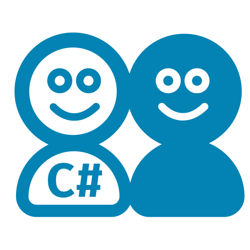

# RoslynBuddy [](https://github.com/xoofx/RoslynBuddy/actions) [](https://www.nuget.org/packages/RoslynBuddy/)



A lightweight utility library to create a Roslyn `AdhocWorkspace` from an existing `solution`/`csproj`, by capturing the CSharp compiler emited command while rebuilding the project.
This can be used primarily for syntax tree inspection/code generation.

## Usage

```csharp
// Rebuild the specified project in Release and capture
var result = CSharpCompilationCapture.Build(@"C:\Path\To\A\Sln\Or\project.csproj", "Release");
var workspace = result.Workspace;
var project = workspace.CurrentSolution.Projects.FirstOrDefault();
var compilation = await project.GetCompilationAsync();
// ...
```

> This library requires a `dotnet` SDK to be installed

## Why?

If you have been using `MSBuildWorkdspace` to get an access to CSharp project, you will find sometimes that it is actually impossible to work with if you are expecting your Roslyn application to run on a different runtime than the one currently installed through the `dotnet` SDK.

This is a known issue [Use more permissive load context for MSBuildWorkspace by default](https://github.com/dotnet/roslyn/issues/49248) and I hope that it will be fix in the future.

To workaround this problem and allow to load a CSharp Project with Roslyn no matter which SDK is intalled, RoslynBuddy is working like this:

- It runs a `dotnet msbuild /t:rebuild` on the project or solution passed to it with an output to a binlog file.
- By running the re-build, we are able to capture the exact `csc` command issued by the build system and we can extract them with by [reading compiler invocations](https://github.com/KirillOsenkov/MSBuildStructuredLog/wiki/Reading-Compiler-invocations) using the fantastic [MSBuildStruturedLog](https://github.com/KirillOsenkov/MSBuildStructuredLog) library.
- We then extract the csc arguments and transform them back to `CSharpCompilationArguments`.
- From this we can create for each `csc` invocation and equivalent Roslyn `Project` that will guarantee the exact same compilation settings.

This was a nice suggestion from [Kirill Osenkov](https://twitter.com/KirillOsenkov) (the author of MSBuildStruturedLog) and it turns out that it was very easy to implement.

## License

This software is released under the [BSD-Clause 2 license](https://opensource.org/licenses/BSD-2-Clause). 

## Related projects

* [Buildalizer](https://github.com/daveaglick/Buildalyzer): A more featured library if you are looking for a better introspection on project references and dependencies
  - In RoslynBuddy, a Project will only contain assembly references in order to compile to CSharp but will not provide full introspection on the original project references.

## Author

Alexandre Mutel aka [xoofx](http://xoofx.com).

